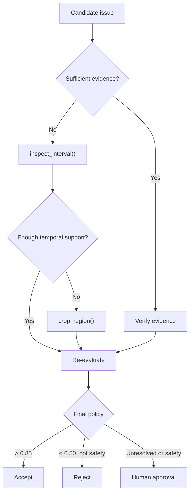

# Step 22 — Actual Decision Policy

**Roadmap step:** 22  
**Status in this bundle:** LIVE AWS PASS — implementation, exact threshold routing, safety guard, bounded investigation, persistence, API/browser wiring, local tests, and deployed SQS-to-COOL validation are complete.

## Goal

Step 22 turns the four earlier evidence tools into a bounded, auditable decision system. Confidence decides whether a candidate can terminate immediately or must enter investigation:

| Candidate confidence | Initial route |
| ---: | --- |
| `> 0.85` | `ACCEPT_CANDIDATE` |
| `0.50–0.85` (inclusive) | `INVESTIGATE_CANDIDATE` |
| `< 0.50` | `REJECT_CANDIDATE`, unless safety-sensitive |

Exactly `0.85` remains in the investigation band because the requirement says **greater than** `0.85`. Exactly `0.50` also enters investigation.

Low-confidence safety-sensitive candidates are never silently accepted. The safety override only prevents automatic rejection and routes the candidate through investigation; unresolved safety evidence ends at `REQUEST_HUMAN_APPROVAL`.

## Investigation graph



The graph is deliberately bounded: one interval inspection and, only when the temporal evidence is insufficient, one crop. The policy does not loop indefinitely or manufacture confidence from repeated tool calls.

## Sufficient-evidence rule

Evidence is sufficient only when all of these are true:

- the candidate is visible;
- evidence quality is at least `0.55`; and
- there are at least two supporting observations or independent views, or a prior multi-view confirmation.

A normal Step-17 finding is tied to one best keyframe, so it does not qualify merely because it has a bbox and timestamp. After `inspect_interval()`, the interval is sufficient only when the model confirms visibility across multiple frames and OpenCV returned at least three frames. Frame count alone is not treated as semantic corroboration.

## Safety override

`is_safety_sensitive()` records its reasons in the trace. It recognizes:

1. an explicit `safety_sensitive=true` flag;
2. high/critical/urgent/safety severity in a narrow safety-relevant category; or
3. narrowly bounded phrases such as exposed wiring, gas leak, fire/smoke, active water leak, structural collapse, broken glass, or trip hazard.

This is a routing guard, not a defect diagnosis. It does not claim that a hazard exists and does not bypass human control.

## Production execution

```http
POST /inspections/{inspection_id}/agent/policy
Content-Type: application/json

{
  "candidate_issue_id": null,
  "seconds_before": 2.0,
  "seconds_after": 3.0,
  "sample_fps": 6.0,
  "crop_padding": 0.15
}
```

If `candidate_issue_id` is omitted, the selector prioritizes unresolved safety candidates, then other investigation candidates, then terminal accept/reject candidates. Every candidate is still returned with its policy evaluation.

Terminal high- and low-confidence decisions are persisted without consuming a COOL job. Investigation follows the existing production path:

```text
FastAPI → deterministic run_decision_policy SQS message
        → Graviton4 COOL worker
        → inspect_interval()
        → crop_region() only if temporal evidence is insufficient
        → structured AI re-evaluation
        → S3 trace + DynamoDB status + CloudWatch events
```

The original video and Step-17 frame are immutable. Derived interval frames and the optional crop are stored under the policy job prefix.

## Trace contract

The completed trace is stored at:

```text
inspections/<inspection_id>/agentic/<job_id>/step22-decision-policy-trace.json
```

It records:

- policy version and exact thresholds;
- candidate and initial evidence assessment;
- safety classification, reasons, and whether the override fired;
- ordered state-machine steps;
- every tool result and structured model reassessment;
- confidence before, after, and delta;
- final action and human-control requirement;
- COOL/OpenCV runtime identity;
- original-evidence immutability; and
- processing telemetry and CloudWatch lifecycle events.

## Local verification

```bash
pytest -q tests/test_step22_decision_policy.py
python scripts/verify_step22_decision_policy.py \
  --output evaluation/step22/local_verification.json
```

The tests cover exact threshold boundaries, safety override behavior, evidence sufficiency, the complete investigation graph, deterministic candidate priority, strict SQS validation, interval-to-crop orchestration, final re-evaluation, immutable evidence, API/worker/browser wiring, and trace persistence.

## Live AWS acceptance

After deploying the Step-22 commit, run one candidate that requires investigation and capture:

```bash
python scripts/verify_step22_aws.py \
  --inspection-id <inspection-id> \
  --output evaluation/step22/live_aws_verification.json
```

- the `run_decision_policy` SQS message and durable job;
- COOL 3.1 / OpenCV 5.x / aarch64 Graviton4 runtime identity;
- `DECISION_POLICY_STARTED`;
- one or two `DECISION_POLICY_TOOL_COMPLETE` events;
- `DECISION_POLICY_COMPLETE`;
- the persisted Step-22 trace and derived artifact hashes; and
- the final DynamoDB action.

### Verified live result — September 18, 2026

Live AWS validation passed for inspection `96a7a795-498f-4c6c-96d5-ad3a4d0027b3`, job `rv-a5b37620b2cd24c5f8b2438d8618f470`, and Git commit `25d3d24367d552c7860aedf9e2087822f53e70fc`.

The candidate entered `INVESTIGATE_CANDIDATE` at confidence `0.80`. `inspect_interval()` returned 15 hashed frames and established sufficient multi-frame evidence, so the bounded policy correctly skipped `crop_region()`. Re-evaluation raised confidence to `0.90` and produced `ACCEPT_CANDIDATE`.

The job ran on the AWS Graviton4 `m8g.4xlarge` worker with COOL `3.1`, OpenCV `5.1.0-dev`, Python `3.12.3`, and `aarch64`. The verifier checked all 15 S3 artifact hashes, original-evidence immutability, exact thresholds, runtime identity, and the complete `DECISION_POLICY_STARTED` -> `DECISION_POLICY_TOOL_COMPLETE` -> `DECISION_POLICY_COMPLETE` CloudWatch chain. It returned `passed=true` with `errors=[]`. Step 22 is therefore **LIVE AWS PASS**.

## Files added or changed

- `app/decision_policy.py`
- `app/agentic_vision.py`
- `app/config.py`
- `app/models.py`
- `app/processing_jobs.py`
- `app/routers/inspections.py`
- `app/services.py`
- `scripts/cool_worker.py`
- `scripts/verify_step22_decision_policy.py`
- `scripts/verify_step22_aws.py`
- `tests/test_step22_decision_policy.py`
- `web/index.html`
- `evaluation/step22/decision_policy_contract.json`
- `evaluation/step22/local_verification.json`
- `evaluation/step22/test_summary.json`
- `evaluation/step22/live_aws_verification.json`
- `README.md`
